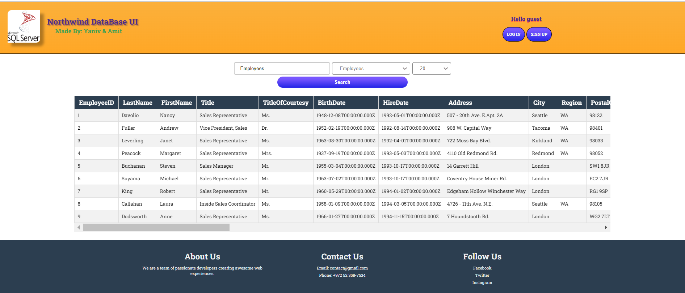
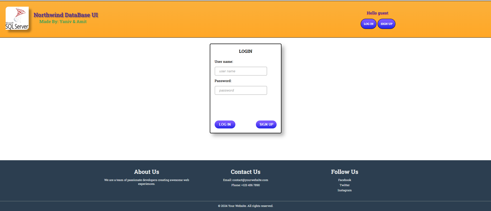
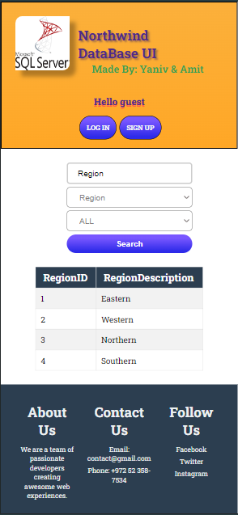
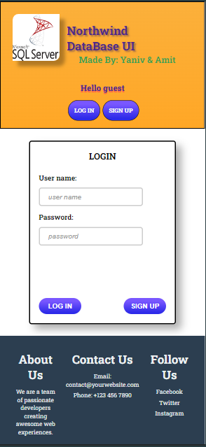

# Practice project for a simple fullstack website   

We used Node.js to connect our mssql database to a vanilla js/css frontend.  
This project focuses on connectivity and adheres to the MVC approach.

## Project Overview
- **Model**: The Northwind MSSQL sample database.

- **View**: A visual representation of the model using html, vanilla js and vanilla css.  
            Connects to the server using the fetch api.

- **Controller**: A Node.js server.

## Contributors
- [Yaniv Ridel](https://github.com/Yanivridel)
- [Amit Kubani](https://github.com/AgitAgit)

## Gallery

### Desktop view
- index: 

- login: 

### Mobile view
- index: 

- login: 

